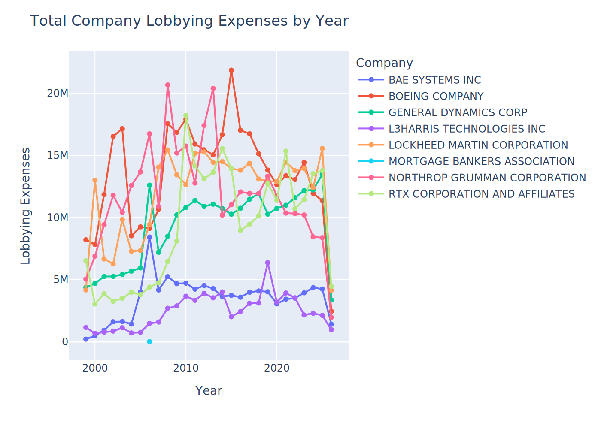
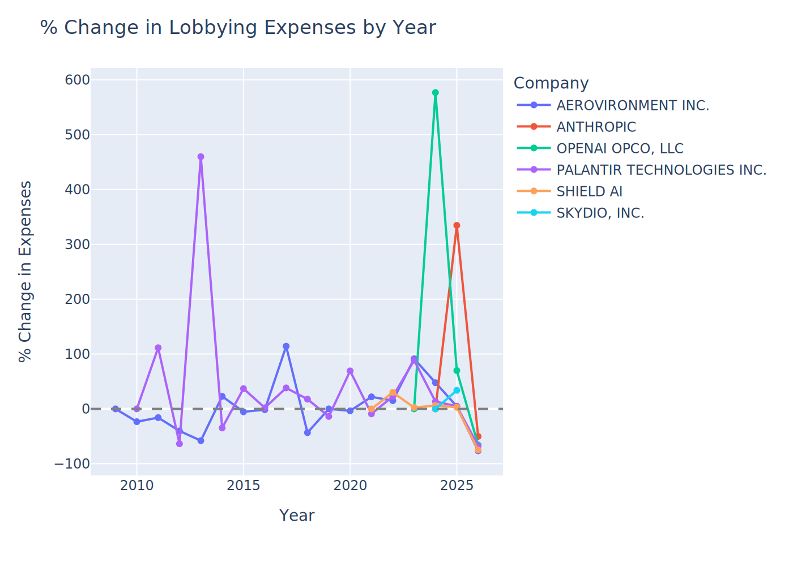
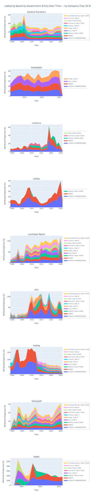
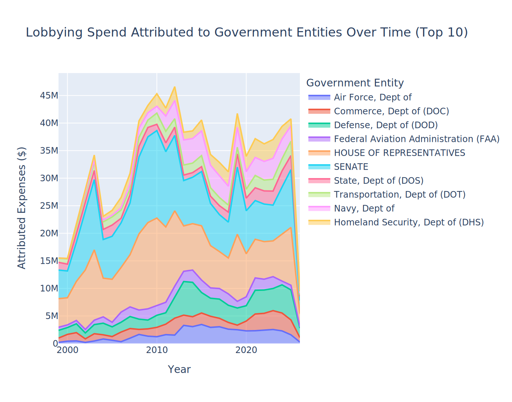
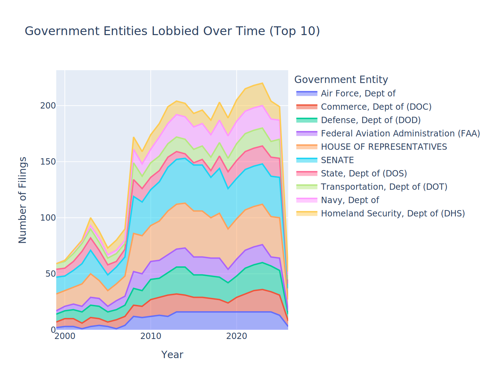
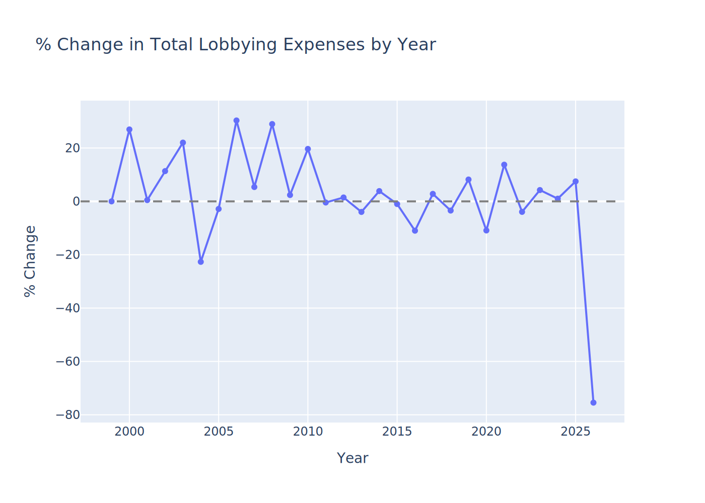
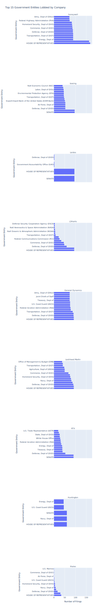
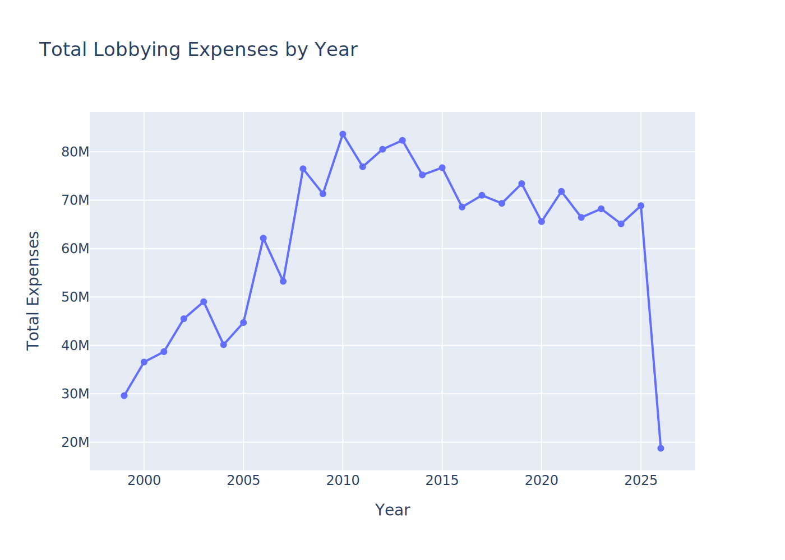
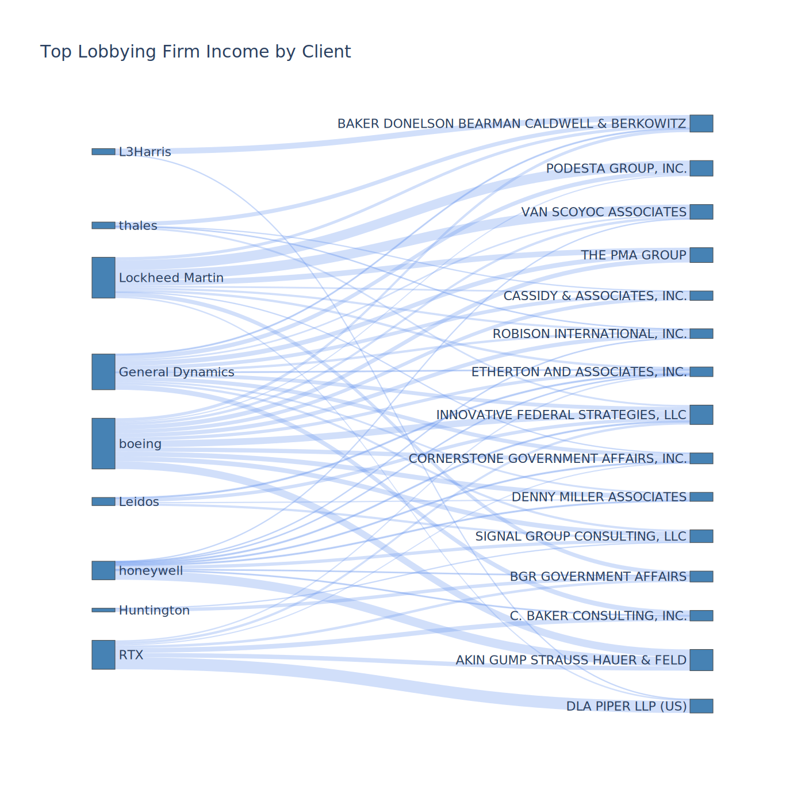

# Lobby Finder
This is a tool I created to pull all available Senate LDA & FEC Records for
a company or companies to get around using Open Secrets and create my own graphics

*It should be mentioned that I used Claude Code to build the original lobbyfinder.py
and to help me write complicated syntax for the data pipeline (particularly for libraries I don't understand, like Plotly) and to help me debug.
However, I did build this cell by cell and fact checked my results at each step
agaisnt a google spreadsheet and Open Secrets to make sure I was developing a
clean pipeline. All in all, I'm responsible for both the success and failures of
this system at the end of the day.*

## Structure

- README.txt -> this file 
- lobbyfinder.py -> this is the python executable that does the CLI based scrapping
- lobbying_filings_Mega.csv -> This is the test dataset I used for the pipeline
- datapipeline1.ipynb -> This is the pipeline for cleaning the .csv and creating graphics for expenses
- datapipeline2.ipynb -> Pipeline for the lobbying firms themsleves (unfinished at time of writing)
- Viz -> Folder where the graphics from the data pipelines will land
- .gitignore -> configured to hide the .env file you ened to create

## How to Use

- (0) - Get an FEC API Key at api.open.fec.gov/v1. It will run without one, but makes life easier
- (0.1) - Create a .env file and load in your FEC API key as MY_KEY=YourKeyHere
- (1) - On command line, navigate to the folder containing Lobby Finder
- (2) - run this command ```python lobbyfinder.py```
- (3) - The program will prompt you to input company names that you want to look for and the final file names
- (4) - Once the program has run, it will export your .csv of results to lobbyfinder_output
- (5) - Drop the output .csv in your Lobby Finder folder or where ever you want to run the pipeline
- (6) - Enter the name of the csv in the pipeline notebook and install dependances
- (7) - Done! You should have graphics and a clean df ready to analyze

# FAQs and potential pitfalls

- (1) When seraching for a firm like Honeywell or Northrup, you will also catch lobbying firms like Rampy Northrup LLC. You will need to clean these out by looking to see if the Client_name or registrant_name columns don't match up with the company you were looking for. 

## Example Graphics












Last Update - 05/03/26
